# 🌟 AIRA — AI & Quantum Computing Personalized LMS

> **"Learn the Future Your Way"** — AIRA synthesizes bespoke, multi-lesson deep tech curriculums calibrated to your unique profession, cognitive background, and learning goals with interactive 3D flashcards, `lmscn` quizzes, and gamified achievement badges.

---

## 🏛️ System Architecture Diagram

```mermaid
graph TD
    subgraph Client_Layer["🖥️ Frontend (Next.js 16 App Router)"]
        UI_Home["Landing Page (App/page.tsx)"]
        UI_Auth["Auth Pages (/login, /signup)"]
        UI_Onboard["Onboarding Questionnaire (/onboarding)"]
        UI_Dash["Dashboard & Badges (/dashboard)"]
        UI_Gen["Course Generator (/generate)"]
        UI_Course["Course Reader & Lessons (/course/[id])"]
        UI_Flash["3D Spaced Flashcards (/flashcards)"]
        UI_Quiz["lmscn Interactive Quiz Engine (/quiz)"]
        UI_Admin["Admin Panel & Live DB Explorer (/admin)"]
    end

    subgraph API_Gateway["⚡ Backend API Gateway (FastAPI)"]
        Router_Auth["/auth (JWT & bcrypt)"]
        Router_Onboard["/onboarding (Profiles)"]
        Router_Courses["/courses (Generation & Lessons)"]
        Router_Admin["/admin (Stats, User/Course CRUD, DB Tables)"]
        Router_Topics["/topics (30+ Curated Subjects)"]
        Auth_Guard["JWT Auth Guard & Admin Role Verifier"]
    end

    subgraph LLM_Engine["🧠 AI Pedagogy & Generative Engine"]
        Prompt_Engine["9-Stage Pedagogy Prompt Builder"]
        LLM_Model["Google Gemini API (gemini-2.0-flash / gemini-1.5-flash)"]
        Schema_Validator["Strict JSON Schema Normalizer & Sanitizer"]
    end

    subgraph Storage_Layer["💾 Database & Persistence (SQLite + SQLAlchemy)"]
        DB_Users["Users Table (is_admin, persona, goals)"]
        DB_Courses["Courses Table (domain, topic, title)"]
        DB_Modules["Modules Table (order, hierarchy)"]
        DB_Lessons["Lessons Table (9 pedagogical sections JSON)"]
        DB_Quizzes["Quizzes Table (MCQ, options, rationales)"]
        DB_Progress["LessonProgress Table (completion checkmarks)"]
        DB_Attempts["QuizAttempts Table (scores & histories)"]
        DB_Badges["Badges Table (milestones e.g. Neural Architect)"]
    end

    %% Client to Backend Flow
    UI_Auth --> Router_Auth
    UI_Onboard --> Router_Onboard
    UI_Dash --> Router_Courses
    UI_Gen --> Router_Courses
    UI_Course --> Router_Courses
    UI_Flash --> Router_Courses
    UI_Quiz --> Router_Courses
    UI_Admin --> Router_Admin

    %% Middleware
    Router_Courses --> Auth_Guard
    Router_Admin --> Auth_Guard

    %% AI Pipeline
    Router_Courses --> Prompt_Engine
    Prompt_Engine --> LLM_Model
    LLM_Model --> Schema_Validator
    Schema_Validator --> Router_Courses

    %% Backend to Database
    Router_Auth --> DB_Users
    Router_Onboard --> DB_Users
    Router_Courses --> DB_Courses
    Router_Courses --> DB_Modules
    Router_Courses --> DB_Lessons
    Router_Courses --> DB_Quizzes
    Router_Courses --> DB_Progress
    Router_Courses --> DB_Attempts
    Router_Courses --> DB_Badges
    Router_Admin --> Storage_Layer
```



---

## 🚀 Quick Start Instructions

### 1. Backend Setup (FastAPI + Python 3.10+)

```bash
# Navigate to backend directory
cd backend

# Configure environment variables
copy .env.example .env
# Edit .env and enter your GEMINI_API_KEY=your_gemini_api_key_here

# Create and activate Python virtual environment
python -m venv venv
.\venv\Scripts\Activate.ps1       # On Windows PowerShell
# source venv/bin/activate        # On Linux/macOS

# Install dependencies
pip install -r requirements.txt

# Start FastAPI server on port 8000
uvicorn main:app --reload --port 8000
```
* **API Server:** `http://localhost:8000`
* **Interactive OpenAPI Docs:** `http://localhost:8000/docs`

---

### 2. Frontend Setup (Next.js 16 + Tailwind CSS)

```bash
# In a new terminal, navigate to frontend directory
cd frontend

# Install npm dependencies
npm install

# Start development server
npm run dev
```
* **Web Application:** `http://localhost:3000`

---

## 🔑 Test Accounts & Demo Credentials

| Role | Username | Password | Persona & Background | Badges & Courses |
|---|---|---|---|---|
| **Learner** | `priya_sharma` | `password123` | **High School STEM Educator**<br>*Calibrated for educational analogies & intuitive visuals* | 🏆 **Neural Architect**<br>Course: *Neural Networks for Educators* (100% Completed) |
| **Learner** | `vedtest` | `password123` | **Business Professional / Strategist**<br>*Calibrated for executive ROI & business metrics* | In-progress courses |
| **Super Admin** | `admin` | `adminpassword123` | **Platform Administrator**<br>*Full oversight, course moderation & DB explorer* | ⚡ Access to `/admin` |

---

## 📚 Persona Profiles & Academic References

AIRA adapts each module's pedagogical complexity to the learner's cognitive domain:

### 1. **Priya Sharma (`priya_sharma`)**
* **Role:** Senior Computer Science & Physics Educator (CBSE / ICSE Board Curriculum)
* **AIRA Pedagogy Focus:** Constructivist learning theory, classroom analogies, scaffolded step-by-step intuition, and formative assessment.
* **Academic References:**
  * Papert, S. (1980). *Mindstorms: Children, Computers, and Powerful Ideas*. Basic Books.
  * Mishra, P., & Koehler, M. J. (2006). *Technological Pedagogical Content Knowledge: A Framework for Teacher Knowledge*. Teachers College Record.
  * Vygotsky, L. S. (1978). *Mind in Society: Development of Higher Psychological Processes*. Harvard University Press.

### 2. **Suggested Indian Industry Personas**:
* **Dr. Ananya Deshmukh (`dr_ananya_deshmukh`)**: Radiologist & Medical Researcher using Convolutional Neural Networks (CNNs) for tumor detection and clinical biomarker discovery.
* **Rohit Verma (`rohit_verma`)**: Lead Software Engineer exploring Transformer Attention Mechanisms, Backpropagation matrix calculus, and Tensor pipelines.
* **Kavita Nair (`kavita_nair`)**: FinTech Risk Quant studying Grover's Quantum Search and Quantum Portfolio Optimization.

---

## ⚙️ Key Platform Features

1. **AI-Powered Generative Curriculums**:
   - Generates 2 progressive modules, 4 structured lessons, and 9-stage pedagogy sections per lesson.
2. **Interactive 3D Spaced Flashcards**:
   - Auto-extracted from lesson takeaways and key concepts with 3D flip card animations (`/course/[id]/flashcards`).
3. **`lmscn` Quiz Engine**:
   - Rich multiple-choice interactive quiz with immediate rationale explanations and score tracking.
4. **Achievement Badges & Mastery**:
   - Automated badge awards (e.g., *Neural Architect*, *Quantum Pioneer*) upon scoring $\ge 80\%$ across all lesson quizzes.
5. **Admin Panel & Live Database Explorer**:
   - Platform KPIs, user deletion/management, course removal, and live SQLite database inspection at `/admin`.

---

## 🛡️ Getting a Free Gemini API Key

1. Visit [Google AI Studio](https://aistudio.google.com/app/apikey).
2. Click **Create API Key**.
3. Add the key to `backend/.env`:
   ```env
   GEMINI_API_KEY=AIzaSy...your_key_here
   ```

---

## 🧪 Testing & Verification

* Run backend automated test suite:
  ```bash
  python backend/test_suite.py
  ```
* Run live frontend in browser: `http://localhost:3000`
