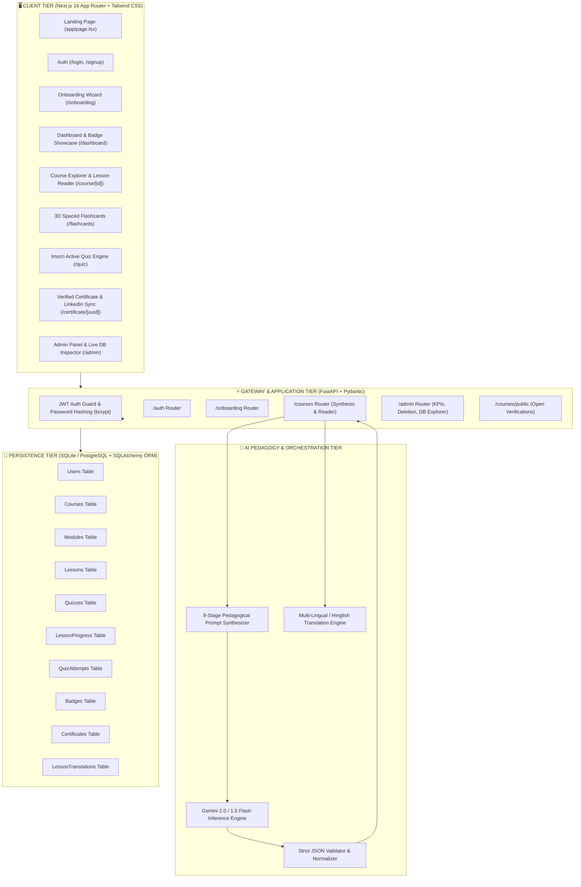
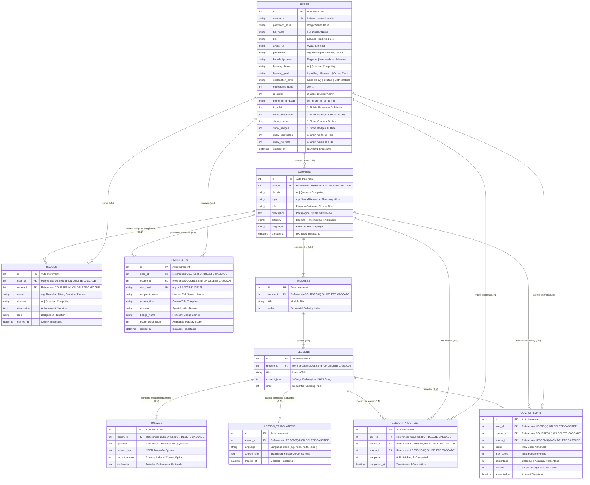
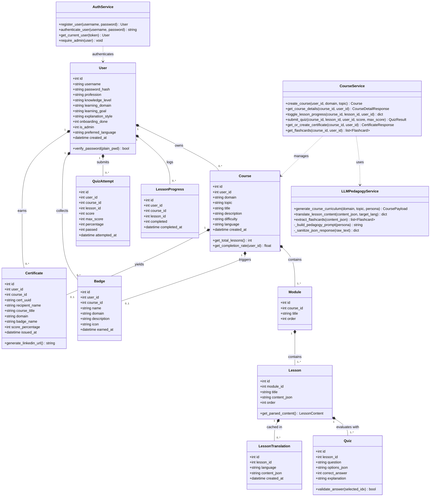
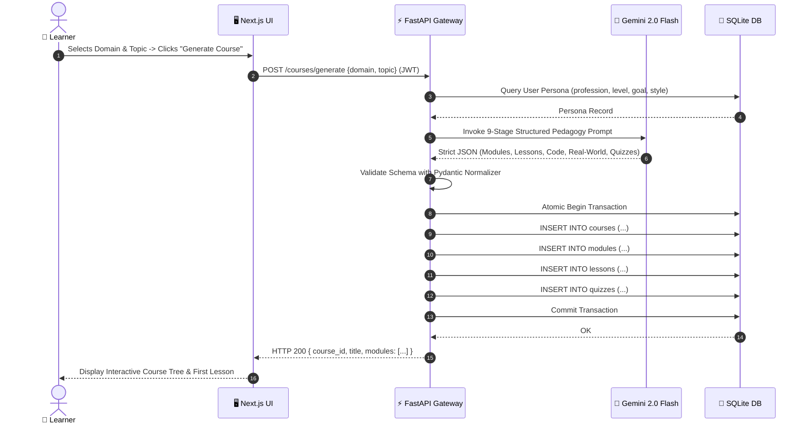
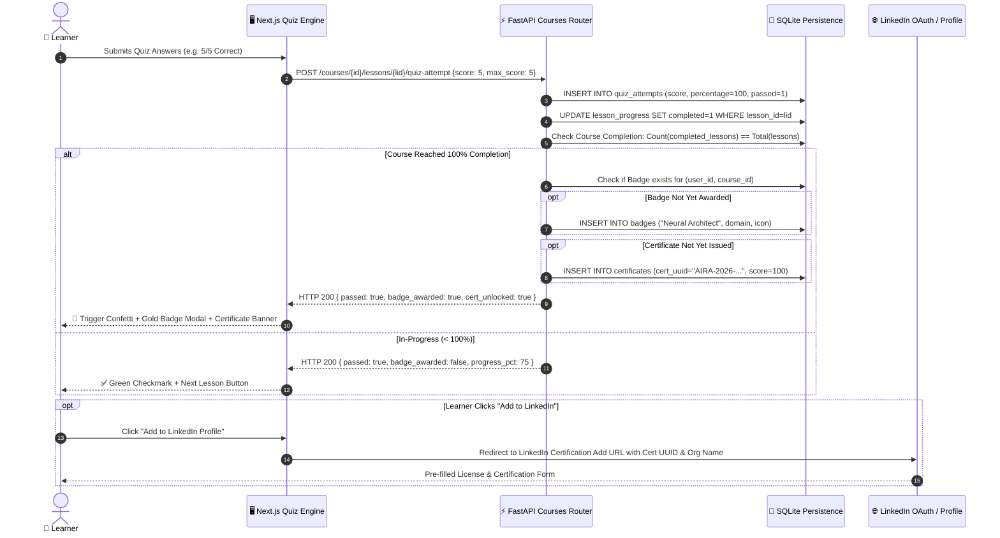
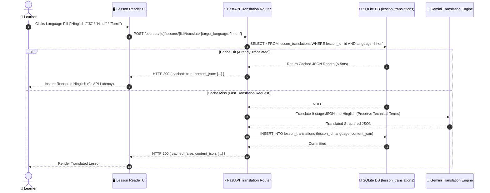
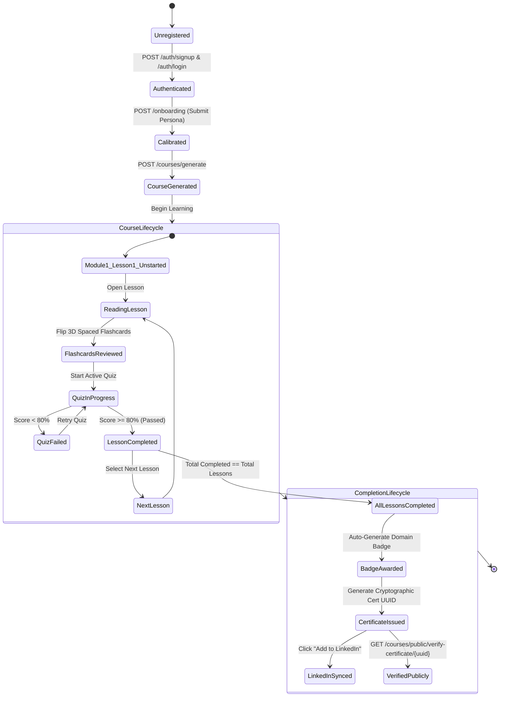
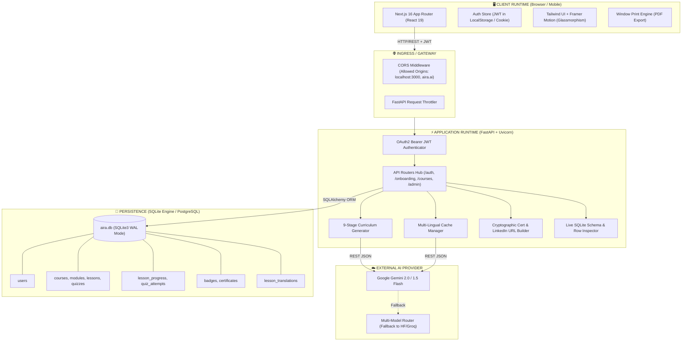

# 📐 AIRA — Technical Design Document (TDD)
### Version: 2.0 | Status: Production Prototype | Architecture: Multi-Tier Micro-Modular

---

## 📑 Table of Contents
1. [Executive Overview & Vision](#1-executive-overview--vision)
2. [High-Level System Architecture](#2-high-level-system-architecture)
3. [Database Architecture & Entity Relationship Diagram (ERD)](#3-database-architecture--entity-relationship-diagram-erd)
4. [Object-Oriented UML Class Diagram](#4-object-oriented-uml-class-diagram)
5. [Component & Sequence Workflows (UML Sequence Diagrams)](#5-component--sequence-workflows)
   - [5.1 Course Generation Pipeline](#51-course-generation-pipeline-uml-sequence)
   - [5.2 Active Quiz, Badge Unlock & Certificate Pipeline](#52-active-quiz-badge-unlock--certificate-pipeline-uml-sequence)
   - [5.3 Multi-Lingual & Hinglish Translation Caching](#53-multi-lingual--hinglish-translation-caching-uml-sequence)
6. [UML State Machine: Learner Progression Lifecycle](#6-uml-state-machine-learner-progression-lifecycle)
7. [UML Component & Deployment Architecture](#7-uml-component--deployment-architecture)
8. [API Interface Specifications](#8-api-interface-specifications)
9. [Security, Auth & Role-Based Access Control (RBAC)](#9-security-auth--role-based-access-control-rbac)
10. [Deployment, Resilience & Caching Strategy](#10-deployment-resilience--caching-strategy)

---

## 1. Executive Overview & Vision

**AIRA (AI-powered Real-time Adaptive LMS)** is a personalized deep-tech educational platform engineered to eliminate the "one-size-fits-all" barrier in Artificial Intelligence and Quantum Computing education.

### Core Architectural Goals:
* **Persona Calibration:** Dynamically synthesize curriculums tailored to 5+ professional backgrounds (Educator, Developer, Finance Executive, Medical Practitioner, Beginner).
* **Deterministic Structured Pedagogy:** Enforce a 9-stage cognitive framework per lesson via strict Pydantic JSON schemas.
* **Active Recall & Mastery Gamification:** Integrate `lmscn` interactive quizzes, 3D spaced repetition flashcards, and score-gated badges ($\ge 80\%$).
* **Verifiable Credentials:** Issue cryptographically verifiable Certificates of Completion with one-click LinkedIn Profile integration.
* **Pan-Indian Accessibility:** On-demand multi-lingual translation supporting English, Hinglish, Hindi, Tamil, Telugu, and Marathi with zero-cost database caching.

---

## 2. High-Level System Architecture

---

## 3. Database Architecture & Entity Relationship Diagram (ERD)

The AIRA persistence layer is designed with strict relational constraints, foreign keys with cascade deletions, and indexing for fast query resolution across learner progress, translation caching, and certification.

---

## 4. Object-Oriented UML Class Diagram

The following UML Class Diagram models the core SQLAlchemy ORM models, Pydantic data transfer objects (DTOs), and service layer controllers.

---

## 5. Component & Sequence Workflows

### 5.1 Course Generation Pipeline (UML Sequence)
1. Client issues `POST /courses/generate` with `{ domain, topic }`.
2. Backend validates user onboarding state and retrieves persona traits.
3. Prompt Engine constructs the 9-stage pedagogical prompt with persona constraints.
4. Gemini returns structured JSON (`response_mime_type="application/json"`).
5. Sanitizer strips extraneous fences and validates JSON keys against Pydantic models.
6. Atomic transaction commits `Course` $\rightarrow$ `Modules` $\rightarrow$ `Lessons` $\rightarrow$ `Quizzes`.

---

### 5.2 Active Quiz, Badge Unlock & Certificate Pipeline (UML Sequence)

---

### 5.3 Multi-Lingual & Hinglish Translation Caching (UML Sequence)

---

## 6. UML State Machine: Learner Progression Lifecycle

This State Machine models the state changes of a learner's progression through a course, from generation to LinkedIn certification.

---

## 7. UML Component & Deployment Architecture

---

## 8. API Interface Specifications

| Endpoint | Method | Auth | Description |
|---|---|---|---|
| `/auth/signup` | `POST` | Public | Register new learner account with bcrypt hash |
| `/auth/login` | `POST` | Public | Authenticate and issue JWT Bearer token |
| `/onboarding` | `POST` | User | Submit profession, domain, goal & style preferences |
| `/onboarding/me` | `GET` | User | Fetch current user profile & admin status |
| `/topics?domain={AI\|QC}` | `GET` | User | Get curated topics for selected frontier |
| `/courses` | `GET` | User | List all user courses with real-time progress |
| `/courses/generate` | `POST` | User | Generate new persona-calibrated course via AI |
| `/courses/{id}` | `GET` | User/Admin | Get comprehensive course details and lesson tree |
| `/courses/{id}/lessons/{lid}/toggle-complete` | `POST` | User | Toggle lesson completion state & recalculate % |
| `/courses/{id}/lessons/{lid}/quiz-attempt` | `POST` | User | Submit quiz score, evaluate badge threshold ($\ge 80\%$) |
| `/courses/{id}/flashcards` | `GET` | User/Admin | Retrieve 3D spaced repetition flashcard deck |
| `/courses/{id}/certificate` | `GET` | User/Admin | Issue or fetch verifiable Certificate & LinkedIn link |
| `/courses/public/verify-certificate/{uuid}` | `GET` | Public | Cryptographic certificate verification endpoint |
| `/courses/{id}/lessons/{lid}/translate` | `POST` | User | Translate lesson to Hinglish, Hindi, Tamil, Telugu, etc. |
| `/profile/me` | `GET` | User | Fetch personal details, learning persona & privacy toggles |
| `/profile/me` | `PUT` | User | Update display name, bio, avatar, domain & showcase privacy |
| `/profile/public/{username}` | `GET` | Public | Public showcase endpoint honoring learner privacy settings |
| `/admin/stats` | `GET` | Admin | Platform KPI analytics (users, courses, badges, avg scores) |
| `/admin/courses` | `GET` | Admin | All platform courses with progress & creator usernames |
| `/admin/courses/{id}` | `DELETE` | Admin | Cascade-delete any user's course |
| `/admin/users` | `GET` | Admin | All registered platform users |
| `/admin/users/{id}` | `DELETE` | Admin | Delete learner account and associated data |
| `/admin/database/tables` | `GET` | Admin | Live table summary list from `aira.db` |
| `/admin/database/table/{name}` | `GET` | Admin | Live row inspector for any SQLite table |

---

## 9. Security, Auth & Role-Based Access Control (RBAC)

* **Authentication Protocol:** OAuth2 Password Bearer flow issuing Signed JWT tokens (`HS256`, 7-day expiration).
* **Password Hashing:** `bcrypt` with dynamic work factor salt ($12$ rounds).
* **Role Hierarchy:**
  * **Learner (`is_admin = 0`):** Isolated course CRUD, own quiz attempts, personal badges & certificates.
  * **Super Admin (`is_admin = 1`):** Platform-wide visibility, course deletion rights, user management, and direct Live SQLite Database table inspector.
* **Client Route Guard:** `<ProtectedRoute>` higher-order component checking token presence, redirecting unauthenticated traffic to `/login` and non-admins away from `/admin`.

---

## 10. Deployment, Resilience & Caching Strategy

* **Frontend:** Next.js 16 (App Router) on Node.js / Vercel with automatic SSR hydration guards.
* **Backend:** FastAPI with Uvicorn ASGI server.
* **Database:** SQLite (file-based `backend/aira.db`) with automatic connection pooling and multi-threaded connection allowances (`check_same_thread=False`).
* **AI Fault Tolerance:**
  * Strict schema validation retry guards.
  * Translation persistence in `lesson_translations` ensures repeated reads incur 0ms network latency and 0 API token cost.

